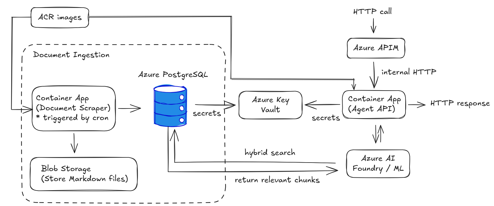
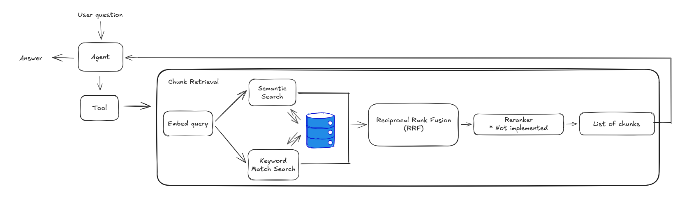

# System Design — RAG Agentic Assistant on Azure

## Overview

The architecture assumes Azure managed services. There is always the solution of a Kubernetes cluster, so the architecture really depends on the option we choose. Some of the mentioned components have direct equivelants that can be managed from Azure, while some others not, so they have to be either self-managed (k8s/AKS) or deployed as Container Apps.

---

## Azure Resources

### Compute: Azure Container Apps

- **API**: always-on, min 1 replica, autoscales on HTTP traffic
- **Scraper**: Azure Container App job triggered by cron that runs every X hours to refresh articles from the source feeds, re-embeds changed documents, upserts into PostgreSQL.

> For more complex ingestion pipelines (multiple sources, transformation steps, retries, backfills), we can use an orchestration tool like **Airflow** or **Dagster**.

### Database: Azure Managed PostgreSQL

- `pgvector` extension enabled for vector similarity search
- Private endpoint where only the internal services can have access to
- Automated backups to prevent data loss

### Document Storage: Azure Blob Storage

Azure blob storage is a good solution to store the Documents as Markdown files. Useful as a source of truth reference.

### Secrets: Azure Key Vault

All secrets stored in Key Vault. Container Apps reference them via managed identity.

### Images: Azure Container Registry

Private registry for container images. Container Apps pull directly from ACR using managed identity.

### API Management: Azure APIM

Rate limiting, authentication, API versioning, and request/response logging. All internal services must not be exposed directly to outer world. 

### Observability

- **Azure Monitor + Log Analytics**: infrastructure metrics, container logs, alerts on scraper failure or API error rate spikes
- **Langfuse**: LLM-specific observability for prompt tracing, token usage, latency per chain step, and retrieval quality metrics.

---

## CI/CD: GitHub Actions

On every push to a branch:

1. Lint (ruff) + format check
2. Run `make test` (unit tests, mocked dependencies)
3. On merge to `main`: build Docker image, push to ACR and deploy new Container App revision

> No deployment happens unless tests pass.

---

## Data Flow

### Ingestion (scheduled)
```
Azure Container App job (Scraper)
  1. fetch the documents
  2. store raw documents (markdown) in Blob Storage
  3. chunk and embed documents
  4. upsert into PostgreSQL
```

### Query (real-time)
```
The client request passes through APIM to reach the Azure Container App.
  1. Agent decides which tool to call (if needed)
  2. embed the user query
  3. hybrid search based on vectors and keyword match
  4. top X results returned as context
  5. Agent reasons and respond back
```

---

## Limitations and Reccomendations

| Limitation | Reccomendation |
|-----|---------------|
| Token truncation | Proper chunking with overlap, chunk-level embeddings |
| Agentic memory | Add memory for multi-turn conversations |
| Fixed k | Dynamic k based on query complexity | 
| English-only FTS | Language detection per document, multilingual stemmer |
| No auth on API | Use APIM service | 
| Chunk order | Introduce a reranker after RRF |
| Keyword match | Replace the keyword match with BM25 |
| Static query | Let the aget rewrite the query for better retrieval |
| Deduplication | Proper deduplication of same/similar documents |
| Trace ID | Introduce a trace ID for easier debugging |
| Cache | Add caching to avoid unncesseseray costs | 
| Guardrails | Input and output guardrails |

## Azure Architecture Diagram


## RAG Pipeline

